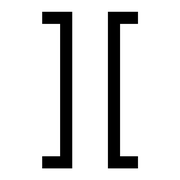

<p align="center">
  
</p>

# M15: Multiscale Post-Hoc Protocol for Auditing Geometric Fidelity of Latent Projections

[](https://doi.org/10.5281/zenodo.20700231)
[](LICENSE)
[](LICENSE-DATA)

## Overview

This repository provides the companion code and data for the paper:

> **M15: A Multiscale Post-Hoc Protocol for Auditing the Geometric Fidelity of Latent Projections**
> Rubén Abella & José Picón (2026)

M15 is a three-layer post-hoc audit protocol that evaluates whether a 2D projection of a latent space preserves sufficient metric, topological, and local semantic-structural integrity for responsible interpretation.

### The Three Layers

| Layer | Method | What it detects |
|-------|--------|-----------------|
| **Global Metric Fidelity** | Mantel Test (Pearson on distance matrices) | Wholesale distance distortions, random projections |
| **Hierarchical Topological Stability** | PH0 Profile over MST (Wasserstein-1, MST ratio) | Bridge collapses, skeleton deformations, cluster merges |
| **Local Semantic-Structural Dissonance** | Fissure Index (Mahalanobis + community-constrained permutation) | Nodes whose semantic profile diverges from their structural community |

### Key Results

The combined classifier achieves **95.9% accuracy**, **96.1% sensitivity**, and **95.0% specificity** on an adversarial benchmark of 10 scenarios (1,000 Monte Carlo simulations, N=100 nodes).

## Repository Structure

```
motor15-geometric-audit/
├── code/
│   ├── m15_metrics.py                  # Core M15 audit engine
│   ├── synthetic_data_generator.py     # Adversarial scenario generator (A-H)
│   ├── reproduce_benchmark_results.py  # Full benchmark runner
│   └── anonymize_dataset.py           # Dataset anonymization utility
├── data/
│   ├── benchmark_raw_results_v2.csv    # Raw benchmark results (1,000 simulations)
│   └── dataset_anonymized.csv          # Anonymized empirical case study (N=457)
├── paper/
│   └── TRACE_M15_PAPER.pdf             # Full paper (Spanish)
├── pseudocode/
│   └── pipeline_m15_classification.md  # Ordinal classifier pseudocode
├── LICENSE                             # MIT (code)
├── LICENSE-DATA                        # CC-BY 4.0 (paper + data)
├── CITATION.cff                        # Machine-readable citation
└── requirements.txt                    # Python dependencies
```

## Quick Start

```bash
# Clone the repository
git clone https://github.com/joinsnipe/motor15-geometric-audit.git
cd motor15-geometric-audit

# Install dependencies
pip install -r requirements.txt

# Reproduce the benchmark (10 scenarios × 100 simulations)
python code/reproduce_benchmark_results.py
```

### Expected Output

The script outputs **raw metric values** for each scenario. Expected metric ranges:

| Scenario | Mantel r_M | W1_norm | D_HT |
|----------|------------|---------|-------|
| A_CLEAN | > 0.95 | < 0.50 | < 0.01 |
| B1_LOW_NOISE | > 0.90 | < 0.55 | < 0.02 |
| B2_MEDIUM_NOISE | 0.75–0.90 | variable | variable |
| B3_HIGH_NOISE | < 0.75 | > 0.65 | variable |
| C_RANDOM | < 0.10 | > 1.0 | > 0.10 |
| D_BRIDGE_COLLAPSE | variable | > 0.65 | variable |
| E_FALSE_OUTLIER | > 0.95 | < 0.55 | < 0.02 |
| F_REAL_FISSURE | > 0.95 | < 0.55 | < 0.02 |
| G_CLUSTER_SWAP | < 0.50 | variable | variable |
| H_SPECTRAL_REWIRE | variable | variable | variable |

To apply the ordinal classification (PASS/WARN/ALERT/FAIL) to these metrics, see the paper (Section 4) for a description of the classification protocol.

## Not Released

The following components are **not released** and remain available under commercial license:

- Calibrated classification thresholds (PASS/WARN/ALERT/FAIL decision boundaries)
- Production implementation of TRACE Suite engines (M01–M16)
- Specific LLM prompts and orchestration logic
- Nominal raw dataset with actor identities
- Commercial reporting and visualization layers

## Authors

- **Rubén Abella** — Capriciousecret S.L. / TRACE Research (Conceptualization, Methodology, Formal analysis, Software, Writing)
- **José Picón** — Neural Ghost (OSINT empirical case study, Data curation, Resources)

## Citation

If you use this code or data, please cite:

```bibtex
@software{abella2026m15,
  author       = {Abella, Rubén and Picón, José},
  title        = {M15: A Multiscale Post-Hoc Protocol for Auditing the Geometric Fidelity of Latent Projections},
  year         = 2026,
  publisher    = {Zenodo},
  doi          = {10.5281/zenodo.20700231},
  url          = {https://doi.org/10.5281/zenodo.20700231}
}
```

## License

- Code in `code/` is licensed under **Apache License 2.0** (see [`LICENSE`](LICENSE)).
- Paper in `paper/` and data in `data/` are licensed under
  **Creative Commons Attribution 4.0 International (CC-BY 4.0)**
  (see [`LICENSE-DATA`](LICENSE-DATA)).

Both licenses require attribution. For commercial licensing of the
non-released production code, contact: ruben@spetrace.com
